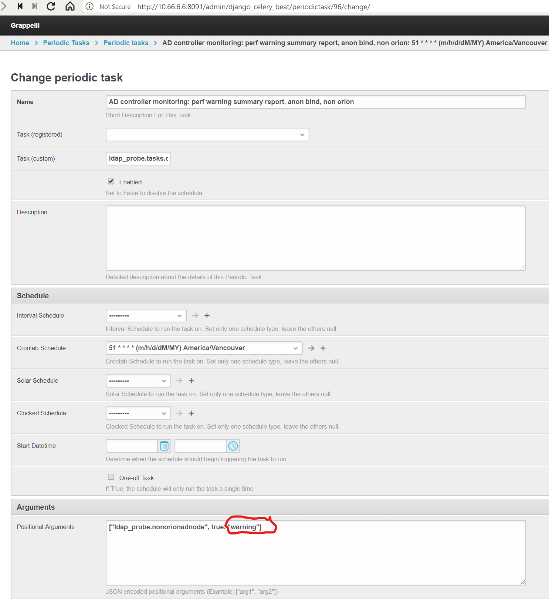

`AD` Services Monitoring Reports
================================

These reports contain a list of `AD` probes that were executed against all
known and enabled `AD` nodes over a configurable interval.

The reporting interval is configurable via the user preference `Time Interval
To Use When Generating Ldap Reports
</../../../admin/dynamic_preferences/globalpreferencemodel/?q=ldap_reports_period>`__.
Currently, this is set to the default value of 1 hour.

These reports are split between :ref:`AD nodes defined in Orion <orionadnodes>`
and :ref:`AD nodes defined outside Orion <nonorionadnodes>`.

Periodic Summary
----------------

This report lists the results of all the `AD` probes executed during the
configured interval summarized as follows:

* Number of failed probes

* Total number of executed probes

* Average response time for the probe initialization for successful probes

  This is not a very significant number because this operation does not
  require any network traffic
  
* Minimum, average, and maximum response for the 
  :ref:`bind and search <bind_and_search>` or for the 
  :ref:`anonymous bind and read root DSE <anon_bind_and_search>` operations
  for successful probes
  
  .. note::
  
    There are separate reports for :ref:`bind and search
    <bind_and_search>` and :ref:`anonymous bind and read root DSE
    <anon_bind_and_search>` probes.
    
These are periodic summary reports:

* :ref:`Full probe data <bind_and_search>` from :ref:`Orion AD nodes
  <orionadnodes>`:
  
  * scheduled from the `AD controller monitoring: summary report, full bind,
    orion` entry on the `periodic tasks configuration page
    </../../../admin/django_celery_beat/periodictask/>`__
    
  * rendered using the `LDAP: summary report, full bind, orion` subscription
    from the `LDAP subscriptions summary page
    </../../../admin/ssl_cert_tracker/subscription/?q=LDAP%3A>`__

* :ref:`Anonymous probe data <anon_bind_and_search>` from :ref:`Orion AD nodes
  <orionadnodes>`:
  
  * scheduled from the `AD controller monitoring: summary report, anon bind,
    orion` entry on the `periodic tasks configuration page
    </../../../admin/django_celery_beat/periodictask/>`__
    
  * rendered using the `LDAP: summary report, anonymous bind, orion`
    subscription from the `LDAP subscriptions summary page
    </../../../admin/ssl_cert_tracker/subscription/?q=LDAP%3A>`__

* :ref:`Full probe data <bind_and_search>` from :ref:`Non Orion AD nodes
  <nonorionadnodes>`:
  
  * scheduled from the `AD controller monitoring: summary report, full bind,
    non orion` entry on the `periodic tasks configuration page
    </../../../admin/django_celery_beat/periodictask/>`__
    
  * rendered using the `LDAP: summary report, full bind, non orion`
    subscription from the `LDAP subscriptions summary page
    </../../../admin/ssl_cert_tracker/subscription/?q=LDAP%3A>`__

* :ref:`Anonymous probe data <anon_bind_and_search>` from :ref:`Non Orion AD
  nodes <nonorionadnodes>`:
  
  * scheduled from the `AD controller monitoring: summary report, anon bind,
    non orion` entry on the `periodic tasks configuration page
    </../../../admin/django_celery_beat/periodictask/>`__
    
  * rendered using the `LDAP: summary report, anonymous bind, non orion`
    subscription from the `LDAP subscriptions summary page
    </../../../admin/ssl_cert_tracker/subscription/?q=LDAP%3A>`__

Periodic Summary for Error Events
---------------------------------

These are reports with a listing of all failed `AD` probes. These reports do
not provide any summarizations.

* :ref:`AD probe errors for :ref:`Orion AD nodes <orionadnodes>` and 
  :ref:`Non Orion AD nodes <nonorionadnodes>`:

  * scheduled from the `AD controller monitoring: error summary report` entry
    on the `periodic tasks configuration page
    </../../../admin/django_celery_beat/periodictask/>`__
    
  * rendered using the `LDAP: error report` subscription
    from the `LDAP subscriptions summary page
    </../../../admin/ssl_cert_tracker/subscription/?q=LDAP%3A>`__

Periodic Summary for Performance Degradation Events
---------------------------------------------------

These reports are based on :ref:`periodic summary reports <Periodic Summary>`
but filtered for the response times that the probe measured for the `bind`
operations.

Performance degradation summary reports
^^^^^^^^^^^^^^^^^^^^^^^^^^^^^^^^^^^^^^^

Currently, the application provides pre-canned performance degradation summary
reports for

* :ref:`Error level performance degradation <perf_err>`

 * :ref:`Full probe data <bind_and_search>` from :ref:`Orion AD nodes
   <orionadnodes>`:
  
   * scheduled from the `AD controller monitoring: perf alert summary report,
     full bind, orion` entry on the `periodic tasks configuration page
     </../../../admin/django_celery_beat/periodictask/>`__
    
   * rendered using the `LDAP: summary report, full bind, perf, orion` subscription
     from the `LDAP subscriptions summary page
     </../../../admin/ssl_cert_tracker/subscription/?q=LDAP%3A>`__

 * :ref:`Anonymous probe data <anon_bind_and_search>` from :ref:`Orion AD nodes
   <orionadnodes>`:
  
   * scheduled from the `AD controller monitoring: perf alert summary report,
     anon bind, orion` entry on the `periodic tasks configuration page
     </../../../admin/django_celery_beat/periodictask/>`__
    
   * rendered using the `LDAP: summary report, anonymous bind, perf, orion`
     subscription from the `LDAP subscriptions summary page
     </../../../admin/ssl_cert_tracker/subscription/?q=LDAP%3A>`__

 * :ref:`Full probe data <bind_and_search>` from :ref:`Non Orion AD nodes
   <nonorionadnodes>`:
  
   * scheduled from the `AD controller monitoring: perf alert summary report,
     full bind, non orion` entry on the `periodic tasks configuration page
     </../../../admin/django_celery_beat/periodictask/>`__
    
   * rendered using the `LDAP: summary report, full bind, perf, non orion`
     subscription from the `LDAP subscriptions summary page
     </../../../admin/ssl_cert_tracker/subscription/?q=LDAP%3A>`__

 * :ref:`Anonymous probe data <anon_bind_and_search>` from :ref:`Non Orion AD
   nodes <nonorionadnodes>`:
  
   * scheduled from the `AD controller monitoring: perf alert summary report,
     anon bind, non orion` entry on the `periodic tasks configuration page
     </../../../admin/django_celery_beat/periodictask/>`__
    
   * rendered using the `LDAP: summary report, anonymous bind, perf, non orion`
     subscription from the `LDAP subscriptions summary page
     </../../../admin/ssl_cert_tracker/subscription/?q=LDAP%3A>`__

* :ref:`Warning level performance degradation <perf_warn>`

 * :ref:`Full probe data <bind_and_search>` from :ref:`Orion AD nodes
   <orionadnodes>`:
  
   * scheduled from the `AD controller monitoring: perf warning summary report,
     full bind, orion` entry on the `periodic tasks configuration page
     </../../../admin/django_celery_beat/periodictask/>`__
    
   * rendered using the `LDAP: summary report, full bind, perf, orion` subscription
     from the `LDAP subscriptions summary page
     </../../../admin/ssl_cert_tracker/subscription/?q=LDAP%3A>`__

 * :ref:`Anonymous probe data <anon_bind_and_search>` from :ref:`Orion AD nodes
   <orionadnodes>`:
  
   * scheduled from the `AD controller monitoring: perf warning summary report,
     anon bind, orion` entry on the `periodic tasks configuration page
     </../../../admin/django_celery_beat/periodictask/>`__
    
   * rendered using the `LDAP: summary report, anonymous bind, perf, orion`
     subscription from the `LDAP subscriptions summary page
     </../../../admin/ssl_cert_tracker/subscription/?q=LDAP%3A>`__

 * :ref:`Full probe data <bind_and_search>` from :ref:`Non Orion AD nodes
   <nonorionadnodes>`:
  
   * scheduled from the `AD controller monitoring: perf warning summary report,
     full bind, non orion` entry on the `periodic tasks configuration page
     </../../../admin/django_celery_beat/periodictask/>`__
    
   * rendered using the `LDAP: summary report, full bind, perf, non orion`
     subscription from the `LDAP subscriptions summary page
     </../../../admin/ssl_cert_tracker/subscription/?q=LDAP%3A>`__

 * :ref:`Anonymous probe data <anon_bind_and_search>` from :ref:`Non Orion AD
   nodes <nonorionadnodes>`:
  
   * scheduled from the `AD controller monitoring: perf warning summary report,
     anon bind, non orion` entry on the `periodic tasks configuration page
     </../../../admin/django_celery_beat/periodictask/>`__
    
   * rendered using the `LDAP: summary report, anonymous bind, perf, non orion`
     subscription from the `LDAP subscriptions summary page
     </../../../admin/ssl_cert_tracker/subscription/?q=LDAP%3A>`__

Defining custom performance degradation reports
^^^^^^^^^^^^^^^^^^^^^^^^^^^^^^^^^^^^^^^^^^^^^^^

It is possible to create additional performance degradation summary reports
using custom response time thresholds.

To create such a report, one must create a new periodic task from the `periodic
tasks configuration page </../../../admin/django_celery_beat/periodictask/>`__
that is a copy of one of the periodic tasks in the section above.

Give the periodic task a different name, choose a schedule, and replace the
last argument in the `Positional arguments` field with the desired performance
degradation threshold measured in seconds and using the `float` format.

Review and save.

For example, in the image below, replace `warning` with `0.750` if the
desired performance degradation threshold is 750 miliseconds.
**Don't forget the quote signs around the float value.** 

 

`AD` Services Network Nodes Reports
===================================

These reports are not directly related to the quality of the `AD` services
available on the `PHSA` networks but to the quality of the data sources
that inform this application about the network nodes providing `AD` services.

These reports are generated and dispatched periodically using a configurable
schedule.

`AD` controller nodes not defined in Orion
------------------------------------------

These are `AD` nodes for which network information is not available in Orion.
Such node are defined under `Domain Controllers not present in Orion
</../../../admin/ldap_probe/nonorionadnode/>`__ and the information on that
page must be maintained manually.

We consider it desirable that the definitions for such `AD` nodes be created
in Orion and, in order to facilitate such an operation, we are providing a
periodic report with said `AD` nodes.

The report is being dispatched via email using the `LDAP: non Orion AD nodes
<../../../admin/ssl_cert_tracker/subscription/?q=LDAP%3A+non+Orion+AD+nodes>`__
email subscription.

The task that generates and executed this report is scheduled by the
`AD controller monitoring: non Orion AD nodes report` periodic task which can be
configured from the `periodic tasks configuration page
</../../../admin/django_celery_beat/periodictask/>`__.

`AD` controller nodes incorrectly defined in Orion
--------------------------------------------------

There are several `AD` nodes that are defined on the `Orion` server but the
information available there is not suitable or incomplete.

All the `AD` nodes that are subject to these reports must be defined as
`domain controllers` on the `Orion` server.

Nodes with no DNS name information
^^^^^^^^^^^^^^^^^^^^^^^^^^^^^^^^^^

These are `AD` nodes defined on the `Orion` server for which the `DNS` `Orion`
property is not set.

The report tracking such nodes is executed automatically using the 
`AD controller monitoring: FQDN Orion AD nodes report` periodic task
scheduled from the `periodic tasks configuration page
</../../../admin/django_celery_beat/periodictask/>`__.

The report is dispatched via email using the `LDAP: Orion FQDN AD nodes
</../../../admin/ssl_cert_tracker/subscription/?q=LDAP%3A+Orion+FQDN+AD+nodes>`__
email subscription.
 

Duplicate nodes
^^^^^^^^^^^^^^^

A subset of the `AD` nodes from above can be (and at least one **is**)
duplicates from an `IP address` perspective. That is absolutely not a correct
`Orion` node definition.

The report tracking such nodes is executed automatically using the 
`AD controller monitoring: Duplicate Orion AD nodes report` periodic task
scheduled from the `periodic tasks configuration page
</../../../admin/django_celery_beat/periodictask/>`__.

The report is dispatched via email using the `LDAP: Duplicate Orion AD nodes
</../../../admin/ssl_cert_tracker/subscription/?q=LDAP%3A+Duplicate+Orion+AD+nodes>`__
email subscription.

Orion DNS name not on DNS server
^^^^^^^^^^^^^^^^^^^^^^^^^^^^^^^^

.. todo::

    See `<https://trello.com/c/Y2gHblhU>`__.