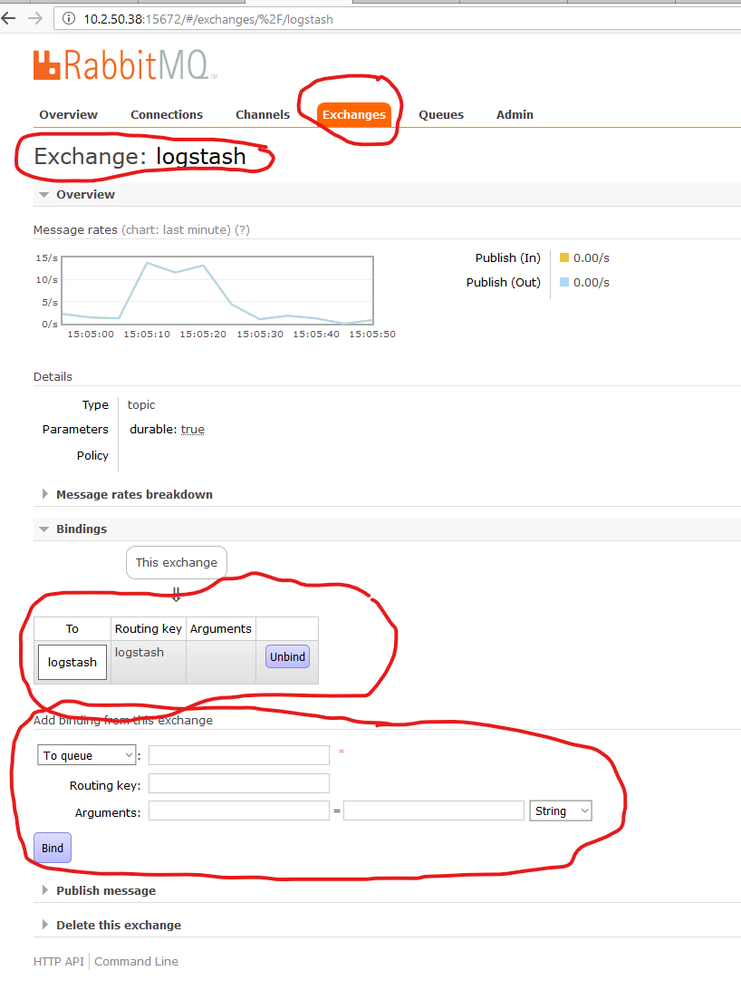

SOC Automation Project
======================

RabbitMQ Server User Guide
--------------------------

See `RabbitMQ server <https://www.rabbitmq.com/>`_ for details about this
messaging server.

We are currently accepting all the installation defaults for the
``RabbitMQ server``.

Resetting the RabbitMQ server
^^^^^^^^^^^^^^^^^^^^^^^^^^^^^

The primary reason for using a `RabbitMQ server <https://www.rabbitmq.com/>`_
is that it makes sure that no information is lost even in case the ``SOC
Automation server`` and/or any of its associated `celery workers 
<http://docs.celeryproject.org/en/latest/userguide/workers.html>`_ dies.

The down side for not losing any data is that in case one or more
`celery workers 
<http://docs.celeryproject.org/en/latest/userguide/workers.html>`_ are restored
after a failure, all the unprocessed messages stored on the ``RabbitMQ server``
will be processed as fast as possible.
This can result in a deluge of alerts about events are out of date and of no
use to the SOC operators. If the number of queued messages is very larger, it
is also possible that the ``celery workers`` will crash again.

The recommended procedure for avoiding such a situation is to purge the
queued messages store of the `RabbitMQ server`` before restarting the
``celery workers``.

:Note:

    This is a very ugly hack.
    
    We really need to figure out and document a procedure using the
    `rabbitmqctl command line tool <https://www.rabbitmq.com/cli.html>`_ to
    replace this hack.
    
This is the emergency procdedure for wiping out the ``RabbitMQ server``
persistent storage for queued messages (obviously as root).

Navigate to the ``RabbitMQ server`` persistent storage directory; stop the
``RabbitMQ server``; delete all the files; start the ``RabbitMQ server``;
restart the ``Logstash`` server; restart the ``SOC Automation server``;
restart the ``celery workers``.

* clean the ``RabbitMQ server`` persistent storage

.. code-block:: bash

    steodore@lvmsocq01:~$ sudo su -
    Last login: Fri Sep 20 09:59:14 PDT 2019 on pts/0
    [root@lvmsocq01 ~]# cd /var/lib/rabbitmq/mnesia/rabbit\@lvmsocq01
    [root@lvmsocq01 rabbit@lvmsocq01]# systemctl stop rabbitmq-server
    [root@lvmsocq01 rabbit@lvmsocq01]# rm -rf *
    [root@lvmsocq01 rabbit@lvmsocq01]# systemctl start rabbitmq-server
    [root@lvmsocq01 rabbit@lvmsocq01]# 

* restart the ``Logstash`` server:

.. code-block:: bash

    [root@lvmsocq01 rabbit@lvmsocq01]# systemctl restart logstash
    [root@lvmsocq01 rabbit@lvmsocq01]# 

* restart the ``SOC Automation server``:

.. code-block:: bash

    [root@lvmsocq01 rabbit@lvmsocq01]# systemctl  restart nginx
    [root@lvmsocq01 rabbit@lvmsocq01]# 
    [root@lvmsocq01 rabbit@lvmsocq01]# systemctl restart uwsgi-phsa-soc-app.service
    [root@lvmsocq01 rabbit@lvmsocq01]# 
    
* restart tyhe ``SOC Automation celery workers``:

.. code-block:: bash

    [root@lvmsocq01 rabbit@lvmsocq01]# systemctl restart phsa_celery_borg_chat.service
    [root@lvmsocq01 rabbit@lvmsocq01]# systemctl restart phsa_celery_citrus_borg.service
    [root@lvmsocq01 rabbit@lvmsocq01]# systemctl restart phsa_celery_ssl.service
    [root@lvmsocq01 rabbit@lvmsocq01]# systemctl restart phsa_celery_shared.service
    [root@lvmsocq01 rabbit@lvmsocq01]# systemctl restart phsa_celery_orion.service
    [root@lvmsocq01 rabbit@lvmsocq01]# systemctl restart phsa_celery_nmap.service
    [root@lvmsocq01 rabbit@lvmsocq01]# systemctl restart phsa_celery_beat.service
    [root@lvmsocq01 rabbit@lvmsocq01]# systemctl restart phsa_celery.service
    [root@lvmsocq01 rabbit@lvmsocq01]# systemctl restart phsa_celery_flower.service
    [root@lvmsocq01 rabbit@lvmsocq01]# systemctl restart phsa_celery_mail_collector.service
    [root@lvmsocq01 rabbit@lvmsocq01]# 

Restoring the RabbitMQ publish/consume manual configuration
^^^^^^^^^^^^^^^^^^^^^^^^^^^^^^^^^^^^^^^^^^^^^^^^^^^^^^^^^^^

Under typical usage, a ``Celery`` application acts as both a ``publisher`` and
a ``cosnumer`` of `AMQP <https://www.amqp.org/>`_ messages. See `Celery -
AMQP Primer <https://docs.celeryproject.org/en/latest/userguide/routing.html#id13>`_
for details.
A ``Celery`` application will also create all the ``queues`` and ``exchanges``
that it is aware of on the ``RabbitMQ server``.
The ``SOC Automation server`` will therefore be aware of the ``logstash``
queue. This queue is defined automatically when loading the
:func:`citrus_borg.consumers.process_win_event`.

The ``SOC Automation server`` also needs to consume `AMQP
<https://www.amqp.org/>`_ messages from the `Logstash
<https://www.elastic.co/products/logstash>`_ server.

The `Logstash <https://www.elastic.co/products/logstash>`_ server will create
the ``logstash`` ``exchange`` automatically when starting. See
:ref:`Logstash Server User Guide` for details.

We must add a ``binding`` from the ``logstash`` ``exchange`` to the
``logstash`` ``queue so that the ``SOC Automation server`` can consume
messages from the `Logstash
<https://www.elastic.co/products/logstash>`_ server.

This is done via the `RabbitMQ Management Web Console
<https://www.rabbitmq.com/management.html>`_.

Logstash Server User Guide
--------------------------

Building the SOC Automation documentation
-----------------------------------------

The documentation for this project using `Sphinx 
<https://www.sphinx-doc.org/en/2.0/>`_.

Special requirements
^^^^^^^^^^^^^^^^^^^^

The documentation includes UML diagrams. In order to automatically generate
these diagrams, the host needs to have these packages installed:

* `PlantUML <http://plantuml.com/index>`_:

  Is used to translate diagrams described using `UML 
  <https://www.uml.org/index.htm>`_ into images, in this particular case,
  into PNG imaged.
  
  On ``CentOS 7.5``, `PlantUML <http://plantuml.com/index>`_ is not available
  as a normal (yum or rpm) install. One must download the `plantuml.jar 
  <http://sourceforge.net/projects/plantuml/files/plantuml.jar/download>`_
  and place it in the :file:/usr/bin directory.
  
  See the ``plantuml`` variable in the :file:docs/source/conf.py for
  configuration details
  
* `GraphViz <https://www.graphviz.org/>`_:

  Is needed by `PlantUML <http://plantuml.com/index>`_ for rendering
  `class diagrams <http://plantuml.com/class-diagram>`_.
  
  Is available as a normal yum install on ``CentOS 7.5``
  
Serving the documentation
^^^^^^^^^^^^^^^^^^^^^^^^^

The documentation is being served over `HTML 
<https://en.wikipedia.org/wiki/HTML>`_ by the SOC Automation web server with
the ``soc_docs`` alias. See :file:/configs/nginx/nginx.conf for details.

:Note:

    There are entries in the docs that use `URL's 
    <https://en.wikipedia.org/wiki/URL>`_ relative to the ``soc_docs`` alias.
    Changes to the mechanism serving the docs will require updated 
    documentation sources.
    
Building the documentation
^^^^^^^^^^^^^^^^^^^^^^^^^^

From the normal command line django dev environment, execute:

.. code-block:: bash

   (phsa_venv) phsa@lvmsocq02:~/p_soc_auto$ cd docs
   (phsa_venv) phsa@lvmsocq02:~/p_soc_auto/docs$ make clean
   Removing everything under 'build'...
   (phsa_venv) phsa@lvmsocq02:~/p_soc_auto/docs$ make html
   Running Sphinx v2.1.2
   making output directory... done
   loading intersphinx inventory from https://docs.python.org/3.6/objects.inv...
   loading intersphinx inventory from http://docs.djangoproject.com/en/2.2/_objects/...
   building [mo]: targets for 0 po files that are out of date
   building [html]: targets for 29 source files that are out of date
   updating environment: 29 added, 0 changed, 0 removed
   reading sources... [100%] ssl_cert_tracker/subscriptions
   looking for now-outdated files... none found
   pickling environment... done
   checking consistency... done
   preparing documents... done
   writing output... [100%] ssl_cert_tracker/subscriptions
   generating indices... genindex py-modindex
   highlighting module code... [100%] ssl_cert_tracker.models
   writing additional pages... search
   copying static files... done
   copying extra files... done
   dumping search index in English (code: en) ... done
   dumping object inventory... done
   build succeeded.
   
   The HTML pages are in build/html.
   (phsa_venv) phsa@lvmsocq02:~/p_soc_auto/docs$

   