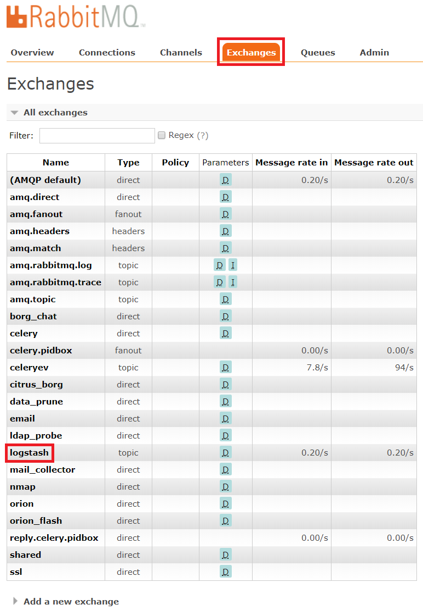
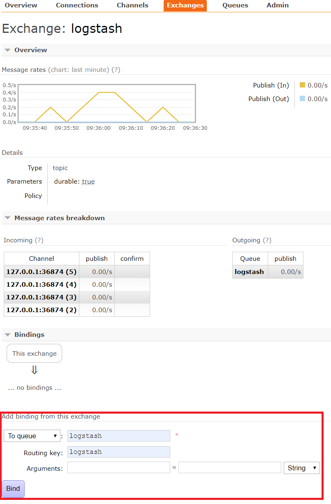
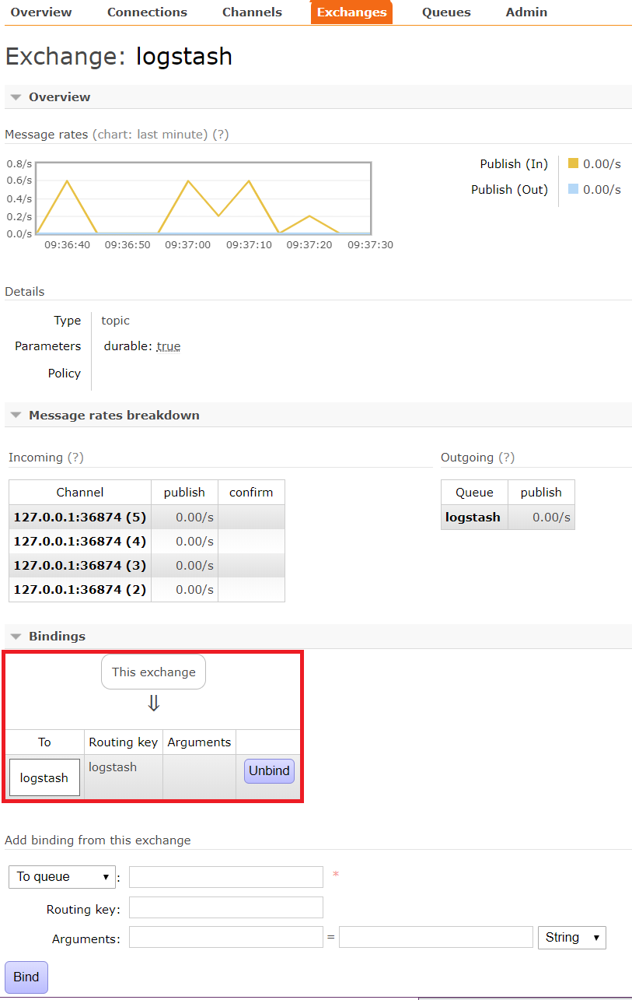

RabbitMQ Server
===============

Within the :ref:`SOC Automation Project`, the `RabbitMQ server
<https://www.rabbitmq.com/>`_ is used as an off-the-shelf component for
brokering interactions between the project components using `AMQP
<https://www.amqp.org/>`_ messages.

See the `RabbitMQ documentation
<https://www.rabbitmq.com/documentation.html>`_ for details about installing,
configuring, and running the `RabbitMQ server
<https://www.rabbitmq.com/>`_.

We are currently accepting all the installation defaults for the
``RabbitMQ server``.

Security considerations
-----------------------

The `RabbitMQ server <https://www.rabbitmq.com/>`_ has built-in
`TLS support <https://www.rabbitmq.com/ssl.html>`_.

Scaling considerations
----------------------

The `RabbitMQ server <https://www.rabbitmq.com/>`_ has built-in
`Clustering support <https://www.rabbitmq.com/clustering.html>`_.

Local Operational Procedures
----------------------------

These are processes used by the :ref:`SOC Automation Project` admin team for
maintaining the `RabbitMQ server <https://www.rabbitmq.com/>`_ deployment.

Resetting the RabbitMQ server
^^^^^^^^^^^^^^^^^^^^^^^^^^^^^

The primary reason for using a `RabbitMQ server <https://www.rabbitmq.com/>`_
is that it makes sure that no information is lost even in case the ``SOC
Automation server`` and/or any of its associated `celery workers 
<http://docs.celeryproject.org/en/latest/userguide/workers.html>`_ dies.

The down side for not losing any data is that in case one or more
`celery workers 
<http://docs.celeryproject.org/en/latest/userguide/workers.html>`_ are restored
after a failure, all the unprocessed messages stored on the ``RabbitMQ server``
will be processed as fast as possible.
This can result in a deluge of alerts about events are out of date and of no
use to the SOC operators. If the number of queued messages is very larger, it
is also possible that the ``celery workers`` will crash again.

The recommended procedure for avoiding such a situation is to purge the
queued messages store of the ``RabbitMQ server`` before restarting the
``celery workers``.

:Note:

    This is a very ugly hack.
    
    We really need to figure out and document a procedure using the
    `rabbitmqctl command line tool <https://www.rabbitmq.com/cli.html>`_ to
    replace this hack.
    
This is the emergency procdedure for wiping out the ``RabbitMQ server``
persistent storage for queued messages (obviously as root).

Navigate to the ``RabbitMQ server`` persistent storage directory; stop the
``RabbitMQ server``; delete all the files; start the ``RabbitMQ server``;
restart the ``Logstash`` server; restart the ``SOC Automation server``;
restart the ``celery workers``.

* clean the ``RabbitMQ server`` persistent storage

.. code-block:: bash

    steodore@lvmsocq01:~$ sudo su -
    Last login: Fri Sep 20 09:59:14 PDT 2019 on pts/0
    [root@lvmsocq01 ~]# cd /var/lib/rabbitmq/mnesia/rabbit\@lvmsocq01
    [root@lvmsocq01 rabbit@lvmsocq01]# systemctl stop rabbitmq-server
    [root@lvmsocq01 rabbit@lvmsocq01]# rm -rf *
    [root@lvmsocq01 rabbit@lvmsocq01]# systemctl start rabbitmq-server
    [root@lvmsocq01 rabbit@lvmsocq01]# 

* restart the *Logstash* server:

.. code-block:: bash

    [root@lvmsocq01 rabbit@lvmsocq01]# systemctl restart logstash
    [root@lvmsocq01 rabbit@lvmsocq01]# 

* restart the ``SOC Automation server``:

.. code-block:: bash

    [root@lvmsocq01 rabbit@lvmsocq01]# systemctl  restart nginx
    [root@lvmsocq01 rabbit@lvmsocq01]# 
    [root@lvmsocq01 rabbit@lvmsocq01]# systemctl restart uwsgi-phsa-soc-app.service
    [root@lvmsocq01 rabbit@lvmsocq01]# 
    
* restart the ``SOC Automation celery workers``:

.. code-block:: bash

    [root@lvmsocq01 rabbit@lvmsocq01]# systemctl restart phsa_celery_borg_chat.service
    [root@lvmsocq01 rabbit@lvmsocq01]# systemctl restart phsa_celery_citrus_borg.service
    [root@lvmsocq01 rabbit@lvmsocq01]# systemctl restart phsa_celery_ssl.service
    [root@lvmsocq01 rabbit@lvmsocq01]# systemctl restart phsa_celery_shared.service
    [root@lvmsocq01 rabbit@lvmsocq01]# systemctl restart phsa_celery_orion.service
    [root@lvmsocq01 rabbit@lvmsocq01]# systemctl restart phsa_celery_nmap.service
    [root@lvmsocq01 rabbit@lvmsocq01]# systemctl restart phsa_celery_beat.service
    [root@lvmsocq01 rabbit@lvmsocq01]# systemctl restart phsa_celery.service
    [root@lvmsocq01 rabbit@lvmsocq01]# systemctl restart phsa_celery_flower.service
    [root@lvmsocq01 rabbit@lvmsocq01]# systemctl restart phsa_celery_mail_collector.service
    [root@lvmsocq01 rabbit@lvmsocq01]# 

Restoring the RabbitMQ publish/consume manual configuration
^^^^^^^^^^^^^^^^^^^^^^^^^^^^^^^^^^^^^^^^^^^^^^^^^^^^^^^^^^^

Under typical usage, a ``Celery`` application acts as both a ``publisher`` and
a ``consumer`` of `AMQP <https://www.amqp.org/>`_ messages. See `Celery -
AMQP Primer <https://docs.celeryproject.org/en/latest/userguide/routing.html#id13>`_
for details.
A ``Celery`` application will also create all the ``queues`` and ``exchanges``
that it is aware of on the ``RabbitMQ server``.
The ``SOC Automation server`` will therefore be aware of the ``logstash``
queue. This queue is defined automatically when loading the
:func:`citrus_borg.consumers.process_win_event`.

The ``SOC Automation server`` also needs to consume `AMQP
<https://www.amqp.org/>`_ messages from the `Logstash
<https://www.elastic.co/products/logstash>`_ server.

The `Logstash <https://www.elastic.co/products/logstash>`_ server will create
the *logstash exchange* automatically when starting. See
:ref:`Logstash Server` for details.

We must add a binding from the *logstash exchange* to the
*logstash queue* so that the *SOC Automation server* can consume
messages from the `Logstash
<https://www.elastic.co/products/logstash>`_ server.

This is done via the `RabbitMQ Management Web Console
<https://www.rabbitmq.com/management.html>`_.

